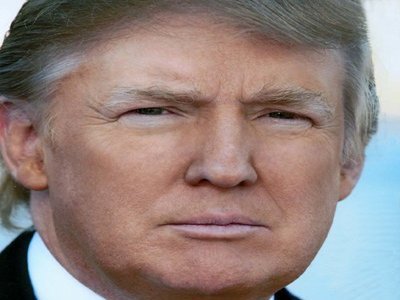

# Deeplearning Neural Style
A simple implementation of neuralstyle in tensorflow. #deeplearning #tensorflow #neuralstyle 

Below is an example:

*The origial Image*

*The style I would like to get*

*Result after 160 iterations*

*The generated image*

Of course, we can always increase the number of iteration to improve the result.

